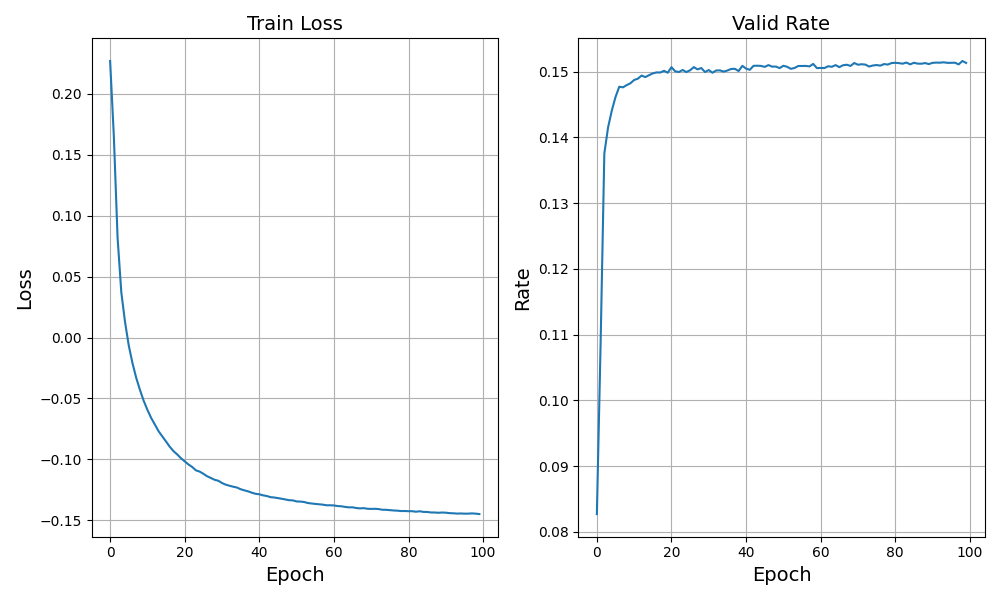

# Decentralized MANET Power Allocation with GNNs

This repository implements and evaluates **decentralized power allocation** algorithms for  
**multi-band OFDM Mobile Ad-Hoc Networks (MANETs)** using **Graph Neural Networks (GNNs)**.  
We compare our GNN approach against a **centralized AdamW optimizer** and a **waterfilling-based benchmark** under Rayleigh and QuaDRiGa channel models.

---

## Features

- **Custom Graph Dataset Generation**  
  - Generates connected graphs with adjustable parameters: number of nodes, frequency bands, noise variance.  
  - Supports loading precomputed channels from `.mat` files.

- **Model Architectures**  
  - GatedGCN + ChainedGNN architectures for decentralized power allocation.  
  - Edge-conditioned **FiLM** modulation and **Jumping Knowledge (JK)** aggregation.

- **Centralized Optimization**  
  - Reference **AdamW** optimizer for global (oracle) baseline.

- **Waterfilling Benchmark**  
  - Analytical single-path power allocation via waterfilling.

- **SNR Sweep Evaluation**  
  - Automated comparison of **GNN**, **centralized AdamW**, and **waterfilling** across SNR values.

- **Training Tools**  
  - Cosine warm restarts scheduler.  
  - Optional SWA.  
  - Best checkpoint saving with automatic cleanup.

---

## Project Structure

```text
├── README.md
├── config/                           # INI/YAML config files
├── data/                             # (Optional) precomputed datasets & channels
├── datasets/
│   └── GraphDataSet.py               # PyG Dataset & collate helpers
├── models/
│   ├── models.py                     # GatedGCNLayer, ChainedGNN
│   └── GraphNetAux.py                # Training loops + τ scheduling
├── scripts/
│   ├── Decentralized_MANET_Simulation.py   # End-to-end training & plots
│   └── Optimizer_vs_GNN.py                 # AdamW vs GNN vs waterfilling eval
├── utils/
│   ├── PathUtils.py                  # Path search + tensorization
│   ├── TensorUtils.py               # Power init & normalization
│   ├── TrainUtils.py                # LR schedulers, checkpoint helpers
│   ├── CentralizedUtils.py          # Centralized AdamW + waterfilling
│   ├── ComparisonUtils.py           # SNR sweep comparison harness
│   ├── ConfigUtils.py              # CLI / INI parsing utilities
│   ├── EstimationUtils.py          # LMMSE estimation helpers
│   ├── FilesUtils.py               # Atomic save + checkpoint management
│   ├── MetricUtils.py              # Rate computation & smooth-min approximation
│   └── DataUtils.py                # Graph generation & dataset building
├── visualization/
│   └── GraphingAux.py              # Training curves & SNR plots
├── matlab/
│   ├── channel_to_freq.m                          # Converts time-domain channel to frequency response
│   ├── generate_quadriga_channels_with_scenario.m # Generates QuaDRiGa-based channels
│   └── quadriga_demo.m                            # Demo for channel generation
└── images/                         # Figures for README & evaluation


```
---
 ## **Installation** 
git clone https://github.com/AlterTomer/Decentralized-MANET.git
cd Decentralized-MANET
pip install -r requirements.txt


---
## **CUDA Support**
This project supports GPU acceleration via CUDA for faster training and evaluation.
If you have a CUDA-enabled GPU and compatible drivers, install the CUDA-enabled version of PyTorch at
https://pytorch.org/get-started/locally/
If CUDA is not available, the code automatically falls back to CPU.

---
## **Usage**
1) Train a GNN: python scripts/Decentralized_MANET_Simulation.py --config config/train.ini
2) Evaluate Performance at Multiple SNRs: python scripts/Optimizer_vs_GNN.py --config config/eval.ini


---
## **Channel Generation (Optional)**
or realistic, geometry-based channels, this repository supports datasets generated with [QuaDRiGa (Fraunhofer HHI)](https://github.com/fraunhoferhhi/QuaDRiGa).

To generate your own channels:

1. Download the official [QuaDRiGa MATLAB package](https://github.com/fraunhoferhhi/QuaDRiGa).
2. Use our provided MATLAB scripts in [`matlab/`](matlab/) to create frequency-domain channel responses:
   - [`channel_to_freq.m`](matlab/channel_to_freq.m): Converts time-domain channel impulse response to frequency-domain response.
   - [`generate_quadriga_channels_with_scenario.m`](matlab/generate_quadriga_channels_with_scenario.m): Generates channels using custom scenarios.
   - [`quadriga_demo.m`](matlab/quadriga_demo.m): Example of generating channel datasets.
3. Export the dataset as `.mat` files.
4. **Important:** The project expects the **frequency-domain channel** \(H(f)\), not the raw time-domain impulse response.
5. If you skip this step, the repository defaults to **Rayleigh fading** for training and evaluation.

---
## Results

Our **ChainedGNN** achieves approximately **80%** of the centralized **AdamW** performance and about **75%** of the **waterfilling benchmark**,  
while requiring significantly fewer computations and producing predictions in a **single forward pass**.

### Method Comparison

| Method            | Global CSI | Computation per Sample                | Scalability |
| ----------------- | ---------- | ------------------------------------- | ----------- |
| **ChainedGNN**    | No         | $\mathcal{O}(L \cdot n^2 (1+B)) \approx 530$ ops | **High**    |
| **AdamW**        | Yes        | $\mathcal{O}(I \cdot B \cdot n^2) \approx 19{,}200$ ops | Low |
| **Waterfilling** | Yes        | $\mathcal{O}(P \cdot B \cdot n^2) \approx 7{,}680$ ops | Low |

---

### Visualization of Results

| Training & Validation | Comparison (Rayleigh) | Comparison (QuaDRiGa) |
| --------------------- | ---------------------- | ---------------------- |
|  |  |  |

- **Left:** Training and validation curves showing efficient model convergence.
- **Middle:** Sum-rate comparison under **Rayleigh fading**.
- **Right:** Sum-rate comparison under **QuaDRiGa channels**.
Both **Rayleigh fading** and **QuaDRiGa** channels were generated with expected value $\mu = 0$ and variance $\sigma^2 = 1$.
